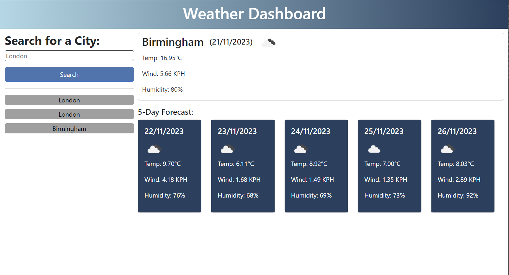

# Weather Dashboard

Welcome to the Weather Dashboard project! This interactive web application provides users with current and future weather forecasts. Designed for ease of use, it's perfect for planning your day with up-to-date weather information.

## Features

- **Current Weather Display**: Shows the current weather details, including temperature, wind speed, and humidity.
- **5-Day Forecast**: Offers a five-day weather forecast with key metrics like temperature and wind speed.
- **Search Functionality**: Users can search for weather forecasts by city name.
- **Recent Searches List**: Displays a list of recently searched cities for quick access.
- **Local Storage Integration**: Saves recent searches in the browser's local storage for easy recall.
- **Dynamic Weather Icons**: Displays weather icons corresponding to the current weather conditions.
- **Responsive Design**: Adapts to various devices and screen sizes for a seamless user experience.

## How to Use

1. Open the Weather Dashboard in your web browser.
2. Enter a city name in the search input and press the search button or enter key.
3. View the current weather details and the 5-day forecast for the selected city.
4. Click on any city name in the recent searches list to quickly view its weather again.
5. Recent searches can be cleared as needed.
6. The dashboard will display updated weather information each time a search is made.

## Technologies Used

- **HTML**: Structures the content and layout of the dashboard.
- **CSS**: Styles the visual elements, including cards and buttons.
- **JavaScript**: Manages the application logic, including API requests and local storage.
- **Bootstrap**: A front-end framework for designing responsive and mobile-first websites.
- **jQuery**: Simplifies HTML document traversal and manipulation, event handling, and Ajax.
- **OpenWeatherMap API**: Provides weather data for the application.
- **Day.js**: A lightweight JavaScript date library to handle dates and times.

## Links

Live URL: https://jsneath.github.io/Weather-dashboard/
Repository: https://github.com/jsneath/Weather-dashboard

